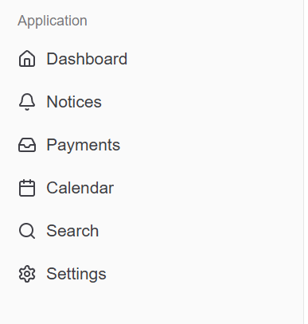
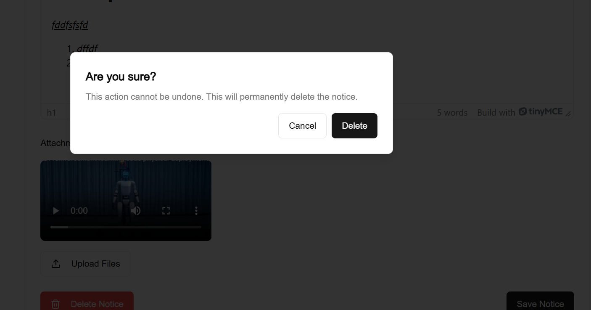
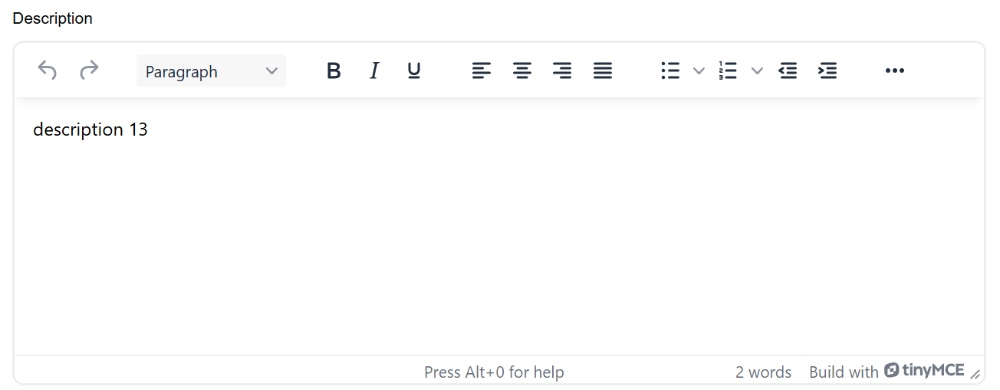
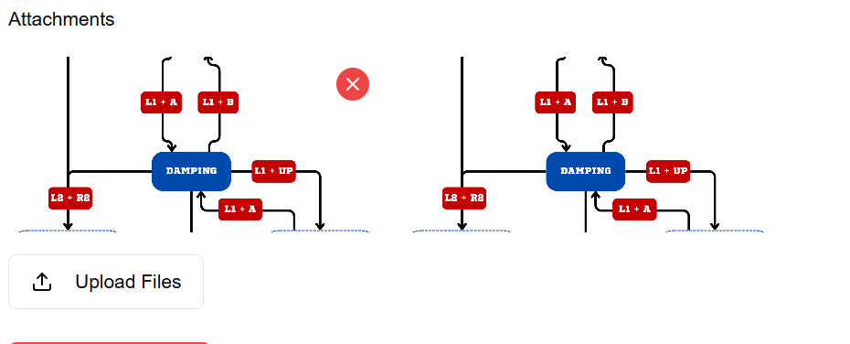

# Launchpad Web Application

## Features

### 1. Notice Management

<!-- - Create and edit notices with a user-friendly interface
- Mark notices as read/unread with a toggle switch
- Delete notices with confirmation dialog -->
- List view with all notices

- Mark notices as read/unread with a toggle switch

- Delete notices with confirmation dialog

### 2. Rich Text Editor
- Full-featured text editor for notice content
- Support for:
  - Bold, Italic, Underline
  - Bullet Lists
  - Numbered Lists
- Real-time preview of formatted content

### 3. File Attachments
- Support for both image and video attachments
- Preview attachments in the notice list
- Upload multiple files at once
- Delete attachments individually
- Responsive preview grid

## API Integration

The application uses a mock API for demonstration purposes. The API endpoints include:

- mock api provides all data except the attachments 
- Attachments are uploaded locally and its url is added to the mock api

